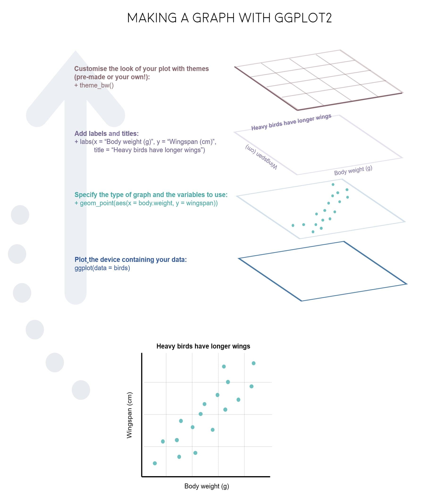

---

<font size = 4> 
**Package Loading**

<br>

As mentioned within the session setup, load the following packages using the `library()` function.

```{r setup, message = FALSE}

  library(tidyverse)
  library(RColorBrewer)
  library(ghibli)
  library(palettetown)

```

---

<font size = 4> 
**Introduction**  

<br>
 
**Example Plot:**  

<br>

To give you an example of how to generally plot in R, using `ggplot2`, we can examine the `diamonds` data set. This is an extremely common example, but is useful to understand how to structure of how to plot. 

```{r}
# Chunk 1
  ggplot(data = diamonds,
         mapping = aes(x = price,
                       y = carat, 
                       colour = cut)) + 
# Chunk 2
  geom_point() + 
# Chunk 3
  labs(title = "Diamonds Plot Example", 
       x = "Price", 
       y = "Carat")

```

<br>

We can break down the code for this plot into three Chunks.  

* Chunk 1: `ggplot()` function, this is the core part of any visualization function, and typically contains information such as specification of the data to be used, and the mapping aesthetics. These details however can also be included within Chunk 2. 
* Chunk 2: `geom` specification, details which type of plot you would like to plot. In this case, we are plotting a point chart, or scatter plot. 
* Chunk 3: Additional Details, such as `labs()`. In this case, specifying the labels which should be included alongside your plot. 

These three components (that is the ggplot function, the geom specification and additional details) are core components of any data visualization. And can be summed up also in the diagram below. 

<br> 



<br> 

Alternatively, this code can be written as so, and produce the same results. 

```{r}
# Chunk 1
  ggplot() + 
# Chunk 2
  geom_point(data = diamonds,
         mapping = aes(x = price,
                       y = carat, 
                       colour = cut)) + 
# Chunk 3
  labs(title = "Diamonds Plot Example", 
       x = "Price", 
       y = "Carat")

```

<br> 


