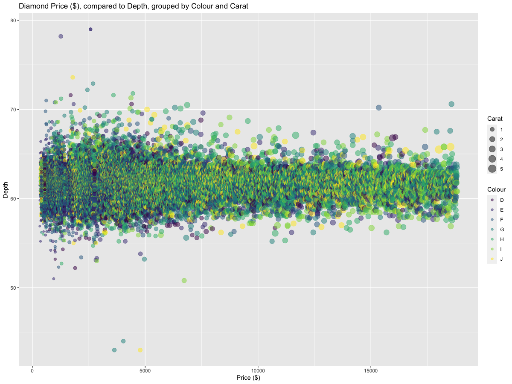

**Level:** Intermediate, some experience required

**Keywords:** R, Data Visualisation, Business Data, Publication

**Note:** Please see Prerequisite Section Below

---

[View Session Slides](</slides/dataviz_business_presentation_plots.html>) - *Opens new Tab*

[Download Session Files](</zip_content/dataviz_biz_pubplots.zip>) - *Downloads .zip file*

---

## Session Summary: 

Although correctly displaying information is important, preparing plots for publication or distribution can arguably considered equally important. During this hands-on practical workshop, we will dive into the more technical aspects of preparing data visualisations for publication including: 

* Specifying visual space: themes, their defaults and how to adapt them.
* Specifying axis's: scales, breaks and designs
* Specifying Labels, Titles, annotations and additional points.
* Specifying Layouts: ggarrange vs faceting

---

## Session Objectives:
* Understand how to apply good data visualisation practices to publish plots
* Understand the flexibility of ggplot, and how to utilize this flexibility in producing 		publishable plots 

## Transferable Skills: 
* Using the tidyverse, in particular ggplot
* Advanced functions in ggplot, relating to specific graphical customization
* Creating standardized plots for publication

---

## Prerequisite Knowledge: 
Participants are must have attended Data Visualization for Business in R: An Introduction, or have sufficient knowledge to reproduce the graphic below: 

## Prerequisite Content: 
Access to R & Rstudio (R’s Graphical User Interface, or RStudio Cloud ([Free Online](<https://rstudio.cloud/>))), Provided ZIP File .zip

 
